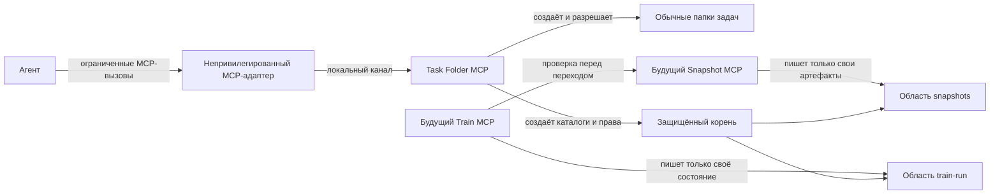

# Архитектура Task Folder MCP

Статус: **приняты границы решения**. Пользователь согласовал архитектуру в диалоге 29.09.2026. Способ локального подключения, учётные записи и язык реализации остаются проектными решениями, которые нужно проверить до реализации.

## Цель и граница системы

Task Folder MCP создаёт и разрешает папки задач по правилам `task-folder-workflow`, ведёт реестр проектов и подготавливает защищённые области для служебных артефактов. Агент может изменять обычные материалы задачи, но не может напрямую изменить или удалить защищённые артефакты.

Сервис **не выбирает TRAIN, не рассчитывает снапшоты и не хранит TrainRun**. Эти обязанности принадлежат будущим Snapshot MCP и Train MCP (либо детерминированному оркестратору). Их исходный код, задачи и roadmap не входят в этот репозиторий.

### Источники и степень определённости

| Вид | Положение | Основание |
| --- | --- | --- |
| Требование | Сохранять правила папок Jira и `NO_JIRA` из `task-folder-workflow`. | Запрос пользователя; текущий skill и реализация `ai-marketplace/plugins/task-folder-workflow`. |
| Решение | Task Folder MCP отвечает только за организацию папок и их защиту; снапшоты и исполнение имеют отдельных владельцев. | Согласование пользователя 29.09.2026. |
| Факт | Сейчас `ai_actions/train-run.yaml` и `ai_actions/result-snapshots/*.json` находятся в обычной папке задачи. | Текущая реализация `train-driver` 0.6.3. |
| Допущение | Агент и привилегированный сервис работают с разными токенами Windows; защищённый корень поддерживает ACL. | Проверить при выборе способа запуска и целевого тома. В одном административном токене требуемой изоляции нет. |
| Неизвестно | Конкретный транспорт, сервисные учётные записи и технология реализации. | Выбрать после проверки локального Host и прав Windows. |

Готовность: **ready-with-assumptions** для документации и проектирования контрактов. Развёртывание нельзя считать защищённым, пока не подтверждена изоляция токенов и прав на реальной машине.

## Представление системы



Диаграмма показывает логические границы и направление вызовов. Названия процессов и транспорт не фиксируют язык реализации.

### Владение и зависимости

| Блок | Владеет | Публичная поверхность | Не входит в ответственность |
| --- | --- | --- | --- |
| Task Folder MCP | Реестр проектов, выделение ключей `NO_JIRA`, разрешение задач, структура каталогов и права на них | Операции с проектами и папками по зарегистрированному ключу | TRAIN, ACTION, снапшот, TrainRun, содержимое защищённых областей |
| Snapshot MCP | Неизменяемые снапшоты и их сравнение | `create_snapshot`, `get_snapshot`, `compare_snapshot` | Реестр задач, TrainRun, переходы |
| Train MCP / оркестратор | TrainRun, маршрут, переходы и история исполнения | Операции исполнения | Создание задач и изменение сохранённых снапшотов |

Task Folder MCP разрешает задачу для других сервисов. Train MCP получает результат проверки непосредственно от Snapshot MCP, а не принимает от агента строку `current` как доказательство. У защищённых артефактов нет двух владельцев записи.

## Данные и граница доверия

Обычная папка сохраняет текущую структуру:

```text
<TASKS_FOLDER>/<год по Москве>/<KEY>/
  origin/ | input/
  update/
  ai_actions/
  retro/
```

Защищённые области логически связаны с тем же ключом и располагаются под отдельным корнем:

```text
<PROTECTED_ROOT>/<KEY>/
  snapshots/
  train-run/
```

Раздельный корень исключает зависимость защиты от прав агента на родительский каталог обычной папки. Агенту закрыты запись, удаление, переименование и изменение прав в защищённом корне. Сам корень, конфигурация сервиса и исполняемые файлы также закрыты для записи агентом. Права будущим сервисам выдаются только на их области при установке соответствующего сервиса; до этого запись принадлежит привилегированному владельцу корня. Проверять нужно права объекта **и его родительских каталогов**: Windows учитывает оба при доступе и удалении ([Microsoft: File Security and Access Rights](https://learn.microsoft.com/en-us/windows/win32/fileio/file-security-and-access-rights)).

Привилегированный процесс запускается отдельно от агента. MCP-адаптер в контексте агента пересылает только объявленные операции через локальный канал; он не получает административный токен. Для канала задаются явные права доступа и проверка вызывающего субъекта. Если используется named pipe, его ACL нельзя оставлять по умолчанию ([Microsoft: Named Pipe Security and Access Rights](https://learn.microsoft.com/en-us/windows/win32/ipc/named-pipe-security-and-access-rights)).

Модель угроз охватывает процесс агента с правом менять обычную папку задачи и вызывать доступные ему MCP-методы. Администратор машины и компрометация самого привилегированного сервиса находятся вне этой гарантии.

Конфигурация `TASKS_FOLDER` и `PROTECTED_ROOT` читается привилегированным сервисом из административно управляемого источника. Клиент не передаёт корни хранения и абсолютные пути назначения. Сервис разрешает зарегистрированный ключ, проверяет допустимые корни и отвергает выход за них, ссылки и junctions. Точный формат конфигурации — открытое решение; прежний агент-доступный config-файл не может быть источником полномочий привилегированного процесса.

## Контракты Task Folder MCP

Сохраняется смысл существующих операций `get_tasks_folder`, `get_task_projects`, `register_task_project`, `create_local_task_folder`, `resolve_task_folder`, `create_task_folder`, `set_task_jira_host`. Внешний контракт версионируется; формат `projects.json` и физический путь защищённого корня остаются внутренними деталями сервиса.

| Операция | Вход | Результат и гарантия | Проверка и отказ |
| --- | --- | --- | --- |
| Разрешить задачу | Ключ задачи | Тип источника, обычная папка и стабильная идентичность задачи | Только зарегистрированный проект; дубли ключа в разных годах — ошибка |
| Создать Jira-папку | Ключ задачи | Стандартные каталоги и защищённые области; повторный вызов проверяет и восстанавливает структуру | Нет произвольного пути; конфликт файла/каталога и неверные права возвращают ошибку. Проверку регистрации проекта нужно согласовать с действующим Jira discovery flow |
| Создать `NO_JIRA` задачу | Ключ проекта, название, постановка | Уникальный номер, `input/task.md`, обычные и защищённые каталоги | Выделение номера сериализовано; после сбоя номер не переиспользуется без доказанной безопасности |
| Зарегистрировать проект / изменить Jira host | Данные проекта или HTTPS origin | Проверенная запись без замены другого проекта | Отдельное административное полномочие; заявленная агентом `provenance` не подтверждает разрешение |

Ни один публичный метод не принимает содержимое файла для произвольной записи в защищённый корень. Ошибки возвращают машинный код и не раскрывают секреты конфигурации. Потребители используют ключ и ответ сервиса, а не разбирают `projects.json` самостоятельно.

## Основные сценарии

1. **Создание задачи.** Адаптер передаёт ключ или запрос `NO_JIRA`; Task Folder MCP проверяет проект, выделяет номер при необходимости, создаёт обычную папку, защищённые области и права, затем возвращает разрешённую задачу. Повторный вызов приводит к тому же результату и устраняет частично созданную структуру.
2. **Использование будущими сервисами.** Snapshot MCP и Train MCP разрешают ключ через Task Folder MCP. Каждый пишет только в свою область. Train MCP запрашивает у Snapshot MCP актуальность снапшота непосредственно перед зависящим от неё переходом.
3. **Частичный сбой.** Создание двух корней не является одной файловой транзакцией. Сервис фиксирует выделенный ключ, возвращает ошибку с возможностью повтора и при повторе проверяет фактическое состояние вместо создания второго ключа. При невозможности восстановить права операция завершается ошибкой; защищённая область не объявляется готовой.
4. **Попытка подмены.** Прямое изменение защищённого файла агентом отвергается ОС. Запрос с произвольным путём или ссылкой отклоняется сервисом. Изменение файла в обычном `ai_actions/` не меняет авторитетный артефакт будущих сервисов.

## Альтернативы и решения

| Вопрос | Выбранное направление | Причина и последствие |
| --- | --- | --- |
| Привилегированный процесс | Отдельный сервис и непривилегированный MCP-адаптер | Агент не наследует права сервиса; появляется локальный канал, который нужно защищать и сопровождать. |
| Размещение защищённых данных | Отдельный корень, связанный с задачей по ключу | Права на обычную папку не позволяют удалить защищённый дочерний объект; нужны два корня и восстановление после частичного сбоя. |
| Разделение Train Flow | Отдельные владельцы снимков и TrainRun | Нет общего хранилища на запись; межсервисный контракт нужен при проверке перехода. |

Запуск всего MCP под административным токеном агента и хранение защищённых файлов внутри доступной агенту папки отвергнуты: оба варианта размывают требуемую границу доверия. Локальный транспорт и язык реализации пока не выбраны; выбор должен подтверждать возможность назначить и проверить права Windows без обходного универсального API.

## Проверяемые свойства и тесты

| Приоритет | Воздействие | Ожидаемый ответ и мера проверки |
| --- | --- | --- |
| Критический | Агент пытается создать, изменить, удалить, переименовать защищённый файл или изменить ACL | Все операции отвергнуты под реальным токеном агента; привилегированный сервис сохраняет работоспособность |
| Критический | Клиент передаёт чужой ключ, `..`, абсолютный путь, ссылку или junction | Нет записи за разрешёнными корнями; возвращён определённый код ошибки |
| Высокий | Параллельно создаются локальные задачи одного проекта | Ключи уникальны, счётчик не регрессирует |
| Высокий | Сервис прерывается между созданием обычной и защищённой папок | Повтор восстанавливает одну задачу с корректными правами либо сообщает точный конфликт |
| Высокий | Агент изменяет административную конфигурацию или обращается к локальному каналу напрямую | Конфигурация не меняется; разрешены только методы и роли, предусмотренные контрактом |

Тесты логики проверяют структуру папок, реестр, выделение номеров, повтор операций и ошибки. Контрактные тесты проверяют MCP-схемы и отсутствие универсальных файловых методов. Интеграционные тесты на Windows запускают сервис и клиента под **разными учётными записями** и проверяют реальные ACL, включая права родителей и повтор после сбоя. Существующий `ai-marketplace/tests/test-task-folder-workflow.js` служит набором проверок совместимости поведения. Имитация ACL не заменяет интеграционный тест защиты.

## Риски и открытые решения

| Риск / вопрос | Владелец | Действие до реализации |
| --- | --- | --- |
| Host не поддержит выбранный локальный канал или раздельный запуск | Архитектор и владелец интеграции | Проверить минимальный обмен через реальный Host; затем выбрать транспорт |
| Агент и сервис получат один административный токен | Владелец развёртывания | Подтвердить отдельные учётные записи и проверить отказ доступа на целевой машине |
| Назначенные ACL позволят удалить защищённый объект через родителя | Владелец безопасности сервиса | Интеграционный тест удаления, переименования и изменения прав под токеном агента |
| Существующие TrainRun и снапшоты останутся в `ai_actions` | Владельцы будущих Snapshot MCP и Train MCP | Перенести авторитетную запись в их области и отключить старые пути; до этого не заявлять защиту этих артефактов |

Следующий шаг после этого документа — проверить неизвестные deployment-условия и уточнить контракты реализации. Roadmap и постановки задач здесь не хранятся.
