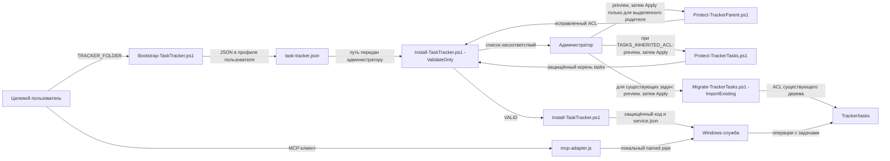

# Установка Task Tracker на новом компьютере

Эта инструкция описывает установку новой службы. Пути клона, личных файлов и Tracker выбираются на месте. Если в `tasks` уже есть файлы, а прежних службы и конфигурации нет, сохраните этот корень и не указывайте `-MigrateTasks`.

Нужны Windows, PowerShell 7, Node.js и .NET Framework C# compiler (`csc.exe`). Node.js и PowerShell должны находиться в каталогах, которые целевой пользователь не может менять: установщик проверяет ACL исполняемых файлов и их родителей. Bootstrap выполняется под целевым пользователем без повышения; защита каталогов и установка службы — под администратором, которым может быть другая учётная запись.

## 1. Подготовить личную структуру

Рекомендуемая схема (имена и диск замените на свои):

```text
<диск>:\AI\                         владелец Administrators
  <пользователь>\                 владелец Administrators
    Work\                         рабочие права пользователя
    TaskTracker\                  после установки владелец сервисная учётная запись
```

`Work` и `TaskTracker` — соседи. Пользователю можно дать полные рабочие права **на `Work`**, включая вложенные файлы и папки. На `AI` и личной папке нельзя оставлять ему `Delete`, `DeleteSubdirectoriesAndFiles`, `ChangePermissions` или `TakeOwnership`; ограниченные права чтения и записи на личной папке допустимы. Нельзя располагать Tracker внутри пользовательского профиля или внутри `Work`: тогда пользователь контролирует его родителя.

Администратор создаёт `AI`, личную папку, `Work` и `TaskTracker`. Для обоих родителей Tracker проверьте план защиты, затем примените его **сверху вниз**:

```powershell
$repo = Read-Host 'Полный путь к клону task-tracker'
$personalRoot = Read-Host 'Полный путь личной папки AI'
$trackerRoot = Join-Path $personalRoot 'TaskTracker'
$workRoot = Join-Path $personalRoot 'Work'
New-Item -ItemType Directory -Path $workRoot, $trackerRoot -Force | Out-Null
pwsh -NoProfile -File (Join-Path $repo 'scripts\Protect-TrackerParent.ps1') -TrackerRoot $personalRoot
pwsh -NoProfile -File (Join-Path $repo 'scripts\Protect-TrackerParent.ps1') -TrackerRoot $personalRoot -Apply
pwsh -NoProfile -File (Join-Path $repo 'scripts\Protect-TrackerParent.ps1') -TrackerRoot $trackerRoot
pwsh -NoProfile -File (Join-Path $repo 'scripts\Protect-TrackerParent.ps1') -TrackerRoot $trackerRoot -Apply
```

Первый вызов защищает `AI`, второй — личную папку. До каждого `-Apply` проверьте вывод `READY` и точный путь родителя. Скрипт меняет владельца родителя на Administrators, удаляет опасные разрешения, сохраняет исходный SDDL в `<repo>\.runtime\tests\protect-tracker-parent\` и сверяет ACL непосредственных детей. Если каталог уже защищён, выводится `ALREADY PROTECTED`. Права на `Work` задавайте отдельно **только на `Work`**. Установщик дополнительно проверит всю цепочку родителей.

### Существующая папка задач

Если в `TaskTracker\tasks` уже есть данные и проверка выдаёт `TASKS_INHERITED_ACL`, администратор выполняет команды `Protect-TrackerTasks.ps1` из диагностики: сначала просмотр `READY`, затем применение с `-Apply`. Скрипт отключает наследование только на корне `tasks`, сохраняя действующие разрешения и не меняя файлы. Резервная копия ACL сохраняется в каталоге `.runtime/tests/protect-tracker-tasks` репозитория. Перед установкой проверьте расположение реестра проектов и служебных файлов; после установки проверьте доступ новой службы к существующим задачам.

По [документации Microsoft о наследовании ACE](https://learn.microsoft.com/en-us/windows/win32/secauthz/ace-inheritance) защищённая DACL прекращает наследование. При обработке ACL родителя скрипт переводит [generic access rights](https://learn.microsoft.com/en-us/windows/win32/secauthz/generic-access-rights) в файловые права. SID S-1-5-32 описан как [домен BUILTIN](https://learn.microsoft.com/en-us/openspecs/windows_protocols/ms-lsat/e09da72e-e6c9-4f91-aa64-68b0475719b6), поэтому предварительная проверка не считает эту запись самой по себе действующим разрешением для пользователя; конкретные группы BUILTIN проверяются отдельно.

~~~powershell
pwsh -NoProfile -File (Join-Path $repo 'scripts\Protect-TrackerTasks.ps1') -TrackerRoot $trackerRoot
pwsh -NoProfile -File (Join-Path $repo 'scripts\Protect-TrackerTasks.ps1') -TrackerRoot $trackerRoot -Apply
~~~

## 2. Bootstrap под целевым пользователем

Откройте обычный PowerShell под владельцем личного Tracker. Добавьте в `%USERPROFILE%\.env\env.txt` строку `TRACKER_FOLDER=<полный путь к TaskTracker>`; такая строка должна быть ровно одна, остальные настройки сохраняются. Затем из любого места выполните:

```powershell
$repo = Read-Host 'Полный путь к клону task-tracker'
pwsh -NoProfile -File (Join-Path $repo 'scripts\Bootstrap-TaskTracker.ps1')
```

Bootstrap выводит путь к пользовательскому `task-tracker.json` и корень Tracker; имя службы записано в JSON. Передайте путь JSON администратору. При конфликте или превышении лимита имени сервисной учётной записи используйте `-ServiceAccountName <другое_имя>`. Bootstrap не перезаписывает существующий JSON с другим корнем: перенос действующего Tracker требует полной переустановки.

## 3. Установка службы под администратором

В PowerShell администратора используйте путь JSON, который вывел bootstrap:

```powershell
$repo = Read-Host 'Полный путь к клону task-tracker'
$configPath = Read-Host 'Полный путь к task-tracker.json из bootstrap'
pwsh -NoProfile -File (Join-Path $repo 'scripts\Install-TaskTracker.ps1') -ConfigPath $configPath -ValidateOnly
pwsh -NoProfile -File (Join-Path $repo 'scripts\Install-TaskTracker.ps1') -ConfigPath $configPath
```

`-ValidateOnly` должен сообщить `VALID` для выбранного Tracker. При отказе он выдаёт все обнаруженные проблемы за один запуск: путь, фактическое состояние, требуемое состояние и исправление. Для выделенного небезопасного родителя выводятся две полные команды `Protect-TrackerParent.ps1`: для предварительного просмотра и с `-Apply`; перед применением администратор должен убедиться, что каталог не общий. Для системного или пользовательского каталога выберите другое место. Исправьте небезопасные пути Node.js/PowerShell и повторите проверку; не обходите её. Установка выполняет ту же проверку до изменений. При первом запуске установщик запросит пароль новой локальной сервисной учётной записи, создаст автоматическую службу и запишет код и `service.json` внутри `TaskTracker\.protected`. Если каталог `TaskTracker` был заранее создан администратором, установщик передаст владение службе.

### Существующие задачи без прежней службы

Если в выбранном Tracker уже есть `projects.json` и `tasks` с задачами, а `TaskFolderMcp` на компьютере отсутствует, не используйте `-MigrateTasks`. После установки администратор запускает просмотр ACL всего дерева через `Migrate-TrackerTasks.ps1 -ImportExisting`. В выводе `READY` проверьте число каталогов и файлов, а также строки `UNREGISTERED`, `NONSTANDARD` и `NONCANONICAL`. Незарегистрированные ключи не блокируют импорт: их папки сохраняются и получают ACL службы. `projects.json` импорт не меняет; доступ к этим задачам через MCP появится после регистрации соответствующих проектов либо установки согласованного реестра. Не назначайте тип проекта по имени папки. С `-Apply` скрипт сохраняет исходные ACL каждого объекта в защищённом каталоге, задаёт права сервисной учётной записи и восстанавливает прежние ACL при ошибке. Файлы задач не удаляются и не переписываются. `tasks/AGENTS.md` остаётся на месте.

~~~powershell
$repo = Read-Host 'Полный путь к клону task-tracker'
$trackerRoot = Read-Host 'Полный путь к TaskTracker'
$installedConfig = Join-Path $trackerRoot '.protected\service.json'
$serviceName = (Get-Content -LiteralPath $installedConfig -Raw | ConvertFrom-Json).serviceName
& (Join-Path $repo 'scripts\Migrate-TrackerTasks.ps1') -ConfigPath $installedConfig -ImportExisting
~~~

Проверьте вывод READY и список отклонений. Только затем в том же повышенном окне выполните:

~~~powershell
$ErrorActionPreference = 'Stop'
Stop-Service -Name $serviceName
$applied = $false
try {
    & (Join-Path $repo 'scripts\Migrate-TrackerTasks.ps1') -ConfigPath $installedConfig -ImportExisting -Apply
    $applied = $true
} finally {
    if ($applied) { Start-Service -Name $serviceName }
}
Get-Service -Name $serviceName | Select-Object Name, Status, StartType
~~~

Если применение завершилось ошибкой, скрипт сам восстанавливает ACL из резервной копии; запустите службу заново. Если служба не запускается после успешного применения, не повторяйте импорт: остановите службу и используйте команду Migrate-TrackerTasks.ps1 -Rollback -BackupPath с путём из строки MIGRATED, затем проверьте журнал службы.

## 4. Подключение клиента

Под обычным токеном **целевого пользователя** нужен плагин `task-folder-workflow` версии 0.5.2 или новее. Убедитесь, что в `%USERPROFILE%\.env\env.txt` есть ровно одна запись `TRACKER_FOLDER` с корнем установленного Tracker. Полностью закройте и перезапустите Codex Desktop, затем проверьте службу:

```powershell
$rid = [Security.Principal.WindowsIdentity]::GetCurrent().User.Value.Split('-')[-1]
Get-Service -Name "TaskTracker-$rid" | Select-Object Name, Status, StartType
```

Ожидаются `Running` и `Automatic`. В Codex отдельно проверьте список опубликованных MCP-инструментов: среди них должен быть `resolve_task_folder`. Вызов `get_tasks_folder` должен вернуть `<TRACKER_FOLDER>\tasks`. Если клиент не подключается, администратор проверяет службу и журнал в `<TRACKER_FOLDER>\.protected\logs`. Простая правка `env.txt` или перенос каталога после установки не меняют закреплённый путь службы.

## 5. Повторная установка и проверка на новом компьютере

Для обновления кода повторите шаг 3 с тем же JSON. Установщик сверит существующую службу с закреплёнными путём, учётной записью и корнем Tracker, затем восстановит `Automatic` и проверит `Running`. Если нужен другой корень, выполните полную повторную установку; не перемещайте действующий каталог и не правьте JSON вручную.

На втором компьютере последовательно проверьте: успешную установку с локальными путями и отдельным администратором; отказ при неверном ACL выделенного родителя; отказ при Node.js и PowerShell в каталоге, изменяемом пользователем; повторную установку с тем же JSON; `Running` и `Automatic` после исправления; вызов `get_tasks_folder` через MCP-клиент. Перед исправлением сохраните диагностический вывод и убедитесь, что в нём нет пароля; пароль вводится только в защищённый запрос `Read-Host -AsSecureString`. При ошибке ACL сравните владельца и разрешения родителя до и после `-ValidateOnly`: они должны совпадать.

## 6. Схема взаимодействий и причины проверок



| Граница и требование | Почему так | Где проверяется или применяется |
| --- | --- | --- |
| Пользователь → JSON → администратор (R1, R2) | Пользователь выбирает корень без повышенных прав; администратор сверяет производные пути и фактического владельца JSON, прежде чем доверять запросу. | [Bootstrap](../scripts/Bootstrap-TaskTracker.ps1), [preflight установщика](../scripts/Install-TaskTracker.ps1) |
| Родители Tracker (R3, R4) | Владелец каталога способен менять его DACL; разрешения `DELETE` и `FILE_DELETE_CHILD` на предке позволяют удалить или заменить защищённый дочерний каталог. Поэтому проверяются владелец, опасные ACE и вся существующая цепочка родителей. | [Проверка и команды исправления](../scripts/Install-TaskTracker.ps1), [защита выделенного родителя](../scripts/Protect-TrackerParent.ps1); [владелец объекта](https://learn.microsoft.com/en-us/windows/win32/secauthz/owner-of-a-new-object), [права файлов](https://learn.microsoft.com/en-us/windows/win32/fileio/file-access-rights-constants) |
| Node.js, PowerShell и C# compiler (R3) | Служба запускает код через эти программы; замена исполняемого файла или его предка даёт возможность подменить выполняемый код. Проверяются владелец, запись/удаление, смена DACL и reparse points. | [Проверка исполняемых путей](../scripts/Install-TaskTracker.ps1); [права файлов и каталогов](https://learn.microsoft.com/en-us/windows/win32/fileio/file-security-and-access-rights) |
| Tracker, `.protected` и `tasks` (R3, R6) | Наследуемые ACE могут дать доступ к дочерним объектам после защиты родителя. Установщик проверяет существующие объекты до изменений и задаёт защищённые DACL для кода, конфигурации и данных службы. | [Проверка и установка ACL](../scripts/Install-TaskTracker.ps1); [наследование ACE](https://learn.microsoft.com/en-us/windows/win32/secauthz/ace-inheritance), [DACL и ACE](https://learn.microsoft.com/en-us/windows/win32/secauthz/dacls-and-aces) |
| Существующие задачи | Защита корня `tasks` прекращает наследование до установки. После установки импорт задаёт ACL каждому существующему объекту и сохраняет исходные ACL для отката; это нужно, поскольку установка новой службы не меняет ACL старых файлов. | [Защита корня tasks](../scripts/Protect-TrackerTasks.ps1), [импорт существующих задач](../scripts/Migrate-TrackerTasks.ps1); [наследование ACE](https://learn.microsoft.com/en-us/windows/win32/secauthz/ace-inheritance) |
| Служба → MCP-клиент (R6) | Сервисная учётная запись владеет служебными файлами; целевой пользователь подключается по локальному pipe с правом чтения/записи, не получая права менять код службы. | [ACL pipe в ServiceHost](../src/ServiceHost.cs), [MCP adapter](../src/mcp-adapter.js) |

`-ValidateOnly` и установка используют один предварительный блок в [Install-TaskTracker.ps1](../scripts/Install-TaskTracker.ps1): обнаруженные нарушения перечисляются до первого изменения. Команда защиты для неизвестного родителя даётся условно: администратор обязан проверить, что каталог выделен только под эту структуру. Общие системные и пользовательские каталоги установщик не исправляет автоматически.
